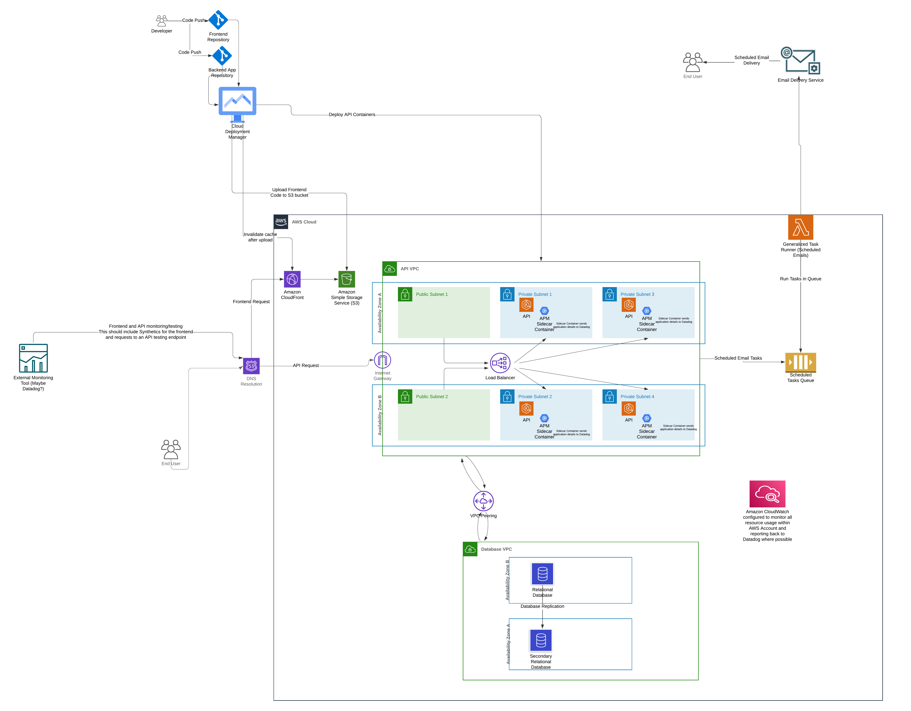

# Project Architecture Documentation

## Overview
This architecture uses AWS services for secure, scalable deployment of a containerized backend and a static front-end. The system includes CloudFront for serving static content, ECS for backend services, RDS for database management, SQS for task processing, and monitoring through both internal (CloudWatch) and external (Datadog) tools.

## Components

### 1. Front-End
- **CloudFront** serves static content from a private **S3 bucket** (HTTPS only).
- **Deployment**: Triggered by a merge to the `main` branch, using CI/CD to automate the build, upload to S3, and invalidate CloudFront.

### 2. Backend Services
- **ECS** runs containerized backend services across two availability zones within **private subnets**.
- **Load Balancer**: A Load Balancer routes traffic from public subnets to the backend in private subnets.
- **Deployment**: Triggered by a merge to the `main` branch, with CI/CD automating container builds, pushing to ECR, and updating ECS services.

### 3. Database Layer
- **RDS (PostgreSQL/MySQL)** is deployed in a separate VPC. Access is restricted to backend services via VPC peering.
- **Backup**: RDS uses multi-AZ and automatic backups for failover.

### 4. Task Processing
- **SQS Queue**: Backend services enqueue tasks (e.g., scheduled emails).
- **Task Runner**: A task runner (e.g., AWS Lambda) processes tasks asynchronously from the queue.

## Monitoring and Observability

### Internal Monitoring (AWS CloudWatch)
- **CloudWatch Alarms**: Used to monitor ECS, RDS, SQS, and infrastructure-level resources. Alerts are sent via SNS or email on threshold breaches.
- **CloudWatch Metrics**: Tracks performance metrics like CPU usage, memory consumption, and request latency across ECS, RDS, and other AWS components.

### External Monitoring (Datadog)
- **Application Logs**: All application logs from ECS services and Lambda functions are forwarded to Datadog for centralized log management and observability. This allows for real-time log analysis, alerting, and correlation with metrics and traces.
- **APM (Application Performance Monitoring)**: Datadog monitors backend service performance, API request tracing, and service-to-service communications.
- **Synthetics**: Datadog synthetic monitoring simulates user interactions, testing front-end uptime and API endpoint performance.
- **Dashboards & Alerts**: Datadog dashboards visualize real-time service metrics, and alerts are configured to notify on performance degradations, errors, or anomalies.

## Data Flow
1. User requests are served via CloudFront from the S3 bucket.
2. Front-end interacts with backend services through the Load Balancer.
3. Backend services communicate with the RDS database and queue tasks in SQS.
4. Task Runner processes tasks from SQS for asynchronous jobs like email notifications.

## Security
- **HTTPS** is enforced for all public-facing endpoints (CloudFront, Load Balancer).
- **Private Subnets**: Backend services and the database reside in private subnets.
- **Encryption**: Data in transit is encrypted via SSL/TLS; data at rest is encrypted in S3 and RDS using AWS KMS.

## Scaling and Performance
- **ECS Auto Scaling**: ECS services scale based on traffic and load, ensuring high availability.
- **CloudFront Caching**: Caches static content for faster delivery to users.
- **SQS Scaling**: Automatically scales to handle varying task loads, ensuring messages are processed without overloading the system.

## Deployment Process

### Front-End Deployment
- **Process**: Static assets are built, uploaded to S3, and CloudFront cache is invalidated.
- **Trigger**: Automatically triggered by a merge to the `main` branch via a CI/CD pipeline (e.g., Jenkins).

### Backend Deployment
- **Process**: Docker images for backend services are built, pushed to ECR, and deployed to ECS.
- **Trigger**: Automatically triggered by a merge to the `main` branch via CI/CD pipeline (e.g., Jenkins).
